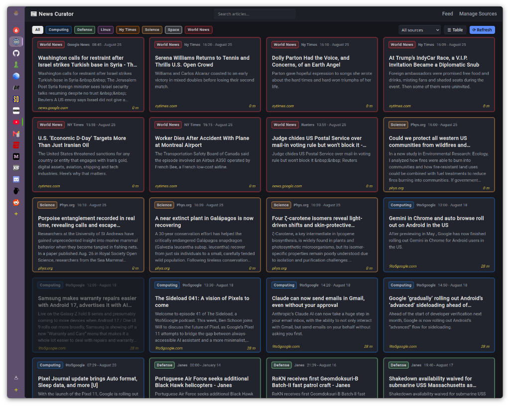
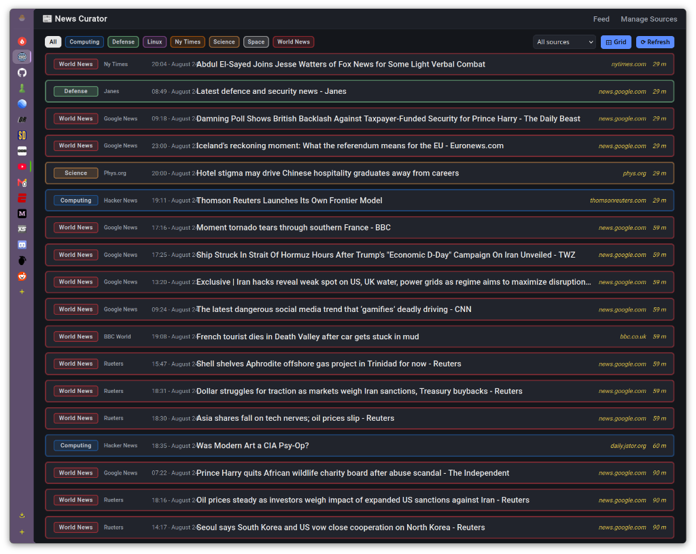
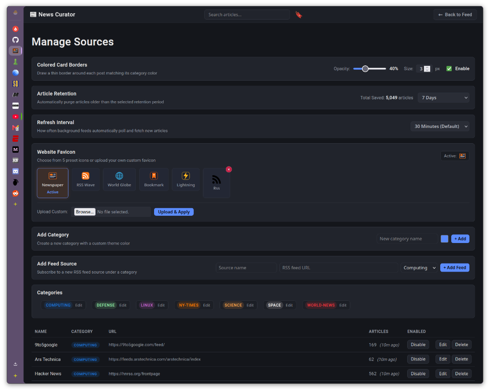

# News Curator — Podman Backup & Deployment

[](https://python.org)
[](https://fastapi.tiangolo.com)
[](https://podman.io)
[](https://sqlite.org)
[](https://palletsprojects.com/p/jinja/)

A fast, self-hosted, dark-themed **RSS news aggregator** dashboard built with **FastAPI**, **Jinja2**, and **SQLite**, running as a rootless **Podman Quadlet** container service.

This repository serves as a complete backup and deployment blueprint containing the entire web application source code, container definition, systemd Quadlet configuration, live container inspection metadata, database snapshot, and application screenshots.

---

## Screenshots

### 1. Grid View (Card Dashboard)
Multi-column responsive card view with color-coded category borders, publication dates, source tags, and relative arrival times:


### 2. Table View (Compact List)
Compact horizontal row list layout for quickly scanning through dozens of news articles:


### 3. Manage Sources & Customization Panel
Source management dashboard for adding RSS feeds, toggling feeds on/off, creating custom categories, modifying palette colors, and tuning card border size and opacity:


---

## Features

- **Dual Viewing Modes (Grid & Table)**: Instant toggle between a modern responsive card grid and a dense table list layout. Preference is automatically remembered across sessions via `localStorage`.
- **Dynamic Category Styling & Custom Borders**:
  - Assign custom HEX colors to individual categories (e.g., *Computing*, *Defense*, *Linux*, *Science*, *Space*, *World News*).
  - Global card border toggle with customizable border width (px) and border opacity slider.
- **Feed Aggregation & Background Polling**:
  - Asynchronous background polling via `feedparser`.
  - Parses dates, links, summaries, and domains.
  - Displays relative fetch timestamps (`29 m`, `59 m`, `90 m`, etc.).
  - Manual on-demand refresh button.
- **Comprehensive Feed & Category Management**:
  - Add, edit, enable/disable, and delete RSS feed sources.
  - Live article counter per feed source and relative last-fetched indicator.
  - Inline category color picker and category renaming with automatic feed migration.
- **Read-State Tracking**:
  - Marking articles as read on click with subtle opacity dimming to focus on unread stories.
- **Private & Lightweight**:
  - Rootless Podman container.
  - SQLite backend operating with WAL mode (`journal_mode = WAL`, `synchronous = NORMAL`) for high-concurrency read/write operations.
  - Zero cloud tracking or third-party telemetry.
- **Systemd Quadlet Integration**:
  - Native systemd service auto-generation via Podman Quadlet (`newscurator.container`).
  - Automatic restart on failure and auto-update support.

---

## Repository Structure

```text
podman-backup-newscurator/
├── README.md                      # Documentation & backup overview
├── newscurator.container          # Podman Quadlet systemd container definition
├── inspect.json                   # podman inspect output for the running container
├── .gitignore                     # Git ignore rules for python cache & artifacts
├── app/                           # FastAPI Application Source Code
│   ├── Containerfile              # Podman/Docker image build definition
│   ├── requirements.txt           # Python dependencies
│   ├── app/
│   │   └── main.py                # FastAPI backend routes, background feed parser, DB models
│   ├── static/
│   │   └── style.css              # Custom dark-theme styling, grid & table CSS, animations
│   └── templates/
│       ├── base.html              # Base Jinja2 layout and navigation bar
│       ├── feeds.html             # Manage Sources & Settings configuration UI
│       └── index.html             # News feed dashboard (Grid and Table views)
├── newscurator-data/              # Data persistence mount
│   └── news.db                    # SQLite database snapshot (feeds, articles, categories, settings)
└── screenshots/                   # Application screenshots
    ├── grid-view.png              # News dashboard in Card Grid view
    ├── table-view.png             # News dashboard in Table view
    └── manage-sources.png         # Source & category management panel
```

---

## Tech Stack & Requirements

- **Backend**: Python 3.12, FastAPI, Uvicorn, Feedparser, Jinja2
- **Database**: SQLite 3 (WAL mode)
- **Frontend**: Vanilla JavaScript, Modern CSS3 with CSS variables (Dark Catppuccin-inspired theme)
- **Container Runtime**: Podman (rootless) + systemd Quadlets

---

## Quickstart & Deployment

### 1. Host Directory Layout

Choose a directory location on your host machine (for example, inside your home directory `~/newscurator` or `/opt/newscurator`):

```bash
# Set your preferred installation directory
export NEWSCURATOR_DIR="$HOME/newscurator"

# Create application and persistent database directories
mkdir -p "$NEWSCURATOR_DIR/app/data"
```

Copy the repository `app/` files into `$NEWSCURATOR_DIR/app/` and place your `news.db` database into `$NEWSCURATOR_DIR/app/data/news.db`.

---

### 2. Build the Podman Image

Build the container image locally:

```bash
cd "$NEWSCURATOR_DIR/app"
podman build -t localhost/newscurator:latest -f Containerfile .
```

---

### 3. Deploy with Podman Quadlet (Recommended)

Systemd Quadlets automatically manage rootless Podman containers as system services.

1. Ensure your user Quadlet directory exists:
   ```bash
   mkdir -p ~/.config/containers/systemd/
   ```

2. Copy or create `newscurator.container` in `~/.config/containers/systemd/newscurator.container`.

**Quadlet Definition (`~/.config/containers/systemd/newscurator.container`)**:
```ini
[Unit]
Description=News Curator
After=network-online.target

[Container]
Image=localhost/newscurator:latest
ContainerName=newscurator
PublishPort=5006:5006
Volume=%h/newscurator/app:/app:Z
Volume=%h/newscurator/app/data:/app/data:Z
AutoUpdate=local

[Service]
Restart=on-failure

[Install]
WantedBy=default.target
```

*(Note: `%h` is a standard systemd specifier that automatically expands to the current user's home directory. Adjust `%h/newscurator/app` if you placed the files in a custom directory).*

3. Reload systemd and start the service:
   ```bash
   # Reload systemd daemon to generate the Quadlet container service
   systemctl --user daemon-reload

   # Start and enable the service
   systemctl --user start newscurator.service
   systemctl --user enable newscurator.service

   # Verify running status
   systemctl --user status newscurator.service
   ```

---

### 4. Alternative: Run Directly via Podman CLI

If you prefer launching directly with the Podman CLI:

```bash
export NEWSCURATOR_DIR="$HOME/newscurator"

podman run -d \
  --name newscurator \
  --replace \
  --restart on-failure \
  -p 5006:5006 \
  -v "$NEWSCURATOR_DIR/app:/app:Z" \
  -v "$NEWSCURATOR_DIR/app/data:/app/data:Z" \
  localhost/newscurator:latest
```

The web dashboard will be available at: **`http://localhost:5006`** (or `http://<server-ip>:5006`).

---

## Database Schema

The application uses SQLite with four core tables:

- **`feeds`**: Registered RSS feed URLs, feed names, category associations, enabled state, and `last_fetched` ISO timestamps.
- **`articles`**: Ingested articles (`guid`, `title`, `link`, `summary`, `published`, `fetched_at`, `status`).
- **`categories`**: Category names and their custom HEX color codes.
- **`settings`**: User configuration key-value pairs (`colored_borders`, `border_opacity`, `border_size`).

---

## Backup & Restoration

### Backup Database
To create a safe online database snapshot while the container is running:
```bash
sqlite3 "$NEWSCURATOR_DIR/app/data/news.db" ".backup ./news_backup.db"
```

### Restore Database
To restore the database:
```bash
# Stop the container
systemctl --user stop newscurator.service

# Replace the database file
cp ./news_backup.db "$NEWSCURATOR_DIR/app/data/news.db"

# Restart the service
systemctl --user start newscurator.service
```

---

## License

Created and maintained by [PlasmaDrifter](https://github.com/PlasmaDrifter). Distributed for personal and self-hosted use.
